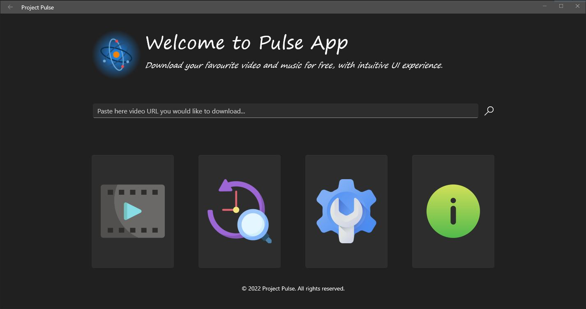

# Pulse App
Download your favourite video and music for free, with intuitive UI experience.

## Gallery

## Current development status
The following items are planned to be included in the next release:

 - [ ] Download Page (2 MD)
 - [ ] Path for ffmpeg (1 MD)
 - [x] WIP for Archive and Advanced download  (0.5 MD)
 - [x] Report bug link (1 MD)
 - [ ] Logging (1 MD)
 - [ ] App Icons (0.5 MD)
 - [ ] Distribution (1 MD)

**Completion percentage:**  

**ETA:**  
23.08.2022 (5.5 MD)

## How to contribute?
At the moment you cannot build _Pulse App_ localy, because it uses local dependencies, but it will change in the future. If you'd like to help to improve _Pulse App_ please report any bugs or improvements ideas by creating issues.

## System requirements:
 * Windows 10 1809 or higher (Yes, it's Windows only, no cross-platform this time 😢)
 * Internet connection (duh!)
 * At least 1 GB of free space for logs collecting purpose

## Credits & Attributions
_Pulse App_ uses two external dependencies:
 * <a href="https://github.com/yt-dlp/yt-dlp">yt-dlp</a>
 * <a href="https://ffmpeg.org/">FFmpeg</a>

You can enjoy beautiful icons embeded in application thanks to the:
<a href="https://www.flaticon.com">flaticon</a>  
Each icon require attribution, so below they are:

 * <a href="https://www.flaticon.com/free-icons/nuclear" title="nuclear icons">Nuclear icons created by photo3idea_studio - Flaticon</a>
 * <a href="https://www.flaticon.com/free-icons/atom" title="atom icons">Atom icons created by Freepik - Flaticon</a>
 * <a href="https://www.flaticon.com/free-icons/video-player" title="video player icons">Video player icons created by Freepik - Flaticon</a>
 * <a href="https://www.flaticon.com/free-icons/history" title="history icons">History icons created by Freepik - Flaticon</a>
 * <a href="https://www.flaticon.com/free-icons/settings" title="settings icons">Settings icons created by Freepik - Flaticon</a>
 * <a href="https://www.flaticon.com/free-icons/info" title="info icons">Info icons created by KP Arts - Flaticon</a>
 * <a href="https://www.flaticon.com/free-icons/headphones" title="headphones icons">Headphones icons created by Freepik - Flaticon</a>
 * <a href="https://www.flaticon.com/free-icons/television" title="television icons">Television icons created by Konkapp - Flaticon</a>
 * <a href="https://www.flaticon.com/free-icons/under-construction" title="under construction icons">Under construction icons created by wanicon - Flaticon</a>

